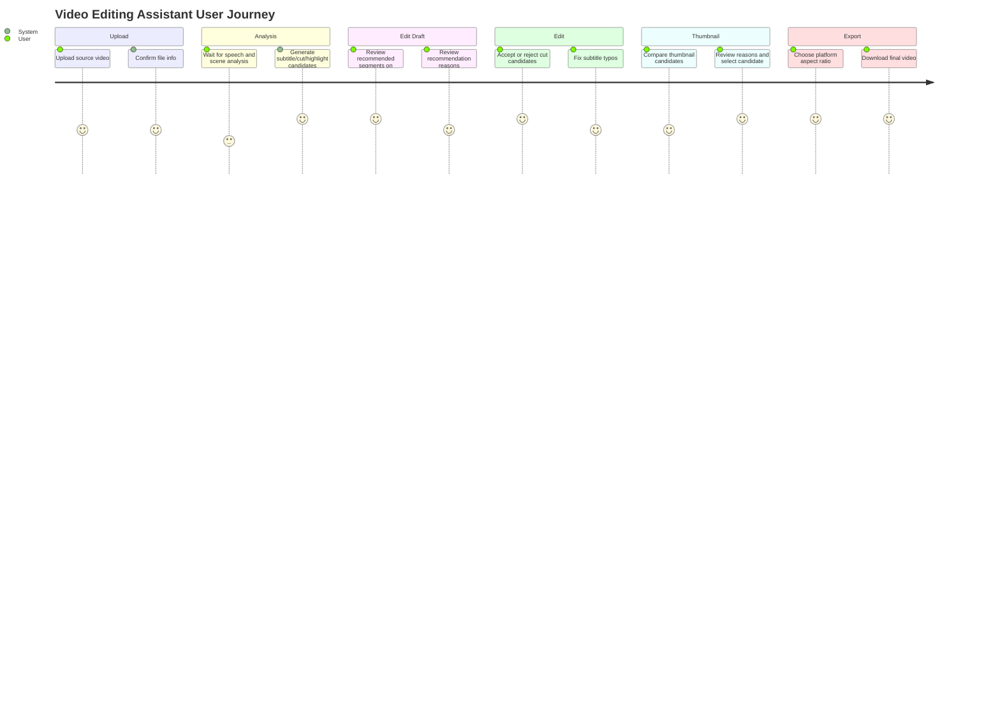

# CutMate AI Planning Draft

> **Document version:** v0.2 (Draft)
> **Date:** 2026-05-29
> **Purpose:** Define problem statement, core features, user flows, MVP scope, and thumbnail recommendation for the video editing assistant system.

---

## 1. Project Overview

### Project Name
- Working title: CutMate AI
- Alternative candidates: ClipPilot, EditMate

### One-Line Definition
- An AI-based video editing assistant that reduces repetitive editor work and speeds up content completion through source video analysis, cut edit suggestions, subtitle/highlight generation, and thumbnail candidate recommendations.

### Core Goals
- Automate repetitive tasks that consume the most time in video editing.
- Help beginners produce edit results above a baseline quality quickly.
- Design as an assistant where the editor keeps final decision-making while AI provides drafts and recommendations.
- Bridge editing completion to upload readiness by suggesting thumbnail candidates after the video is finished.
- Prioritize open-source models and video processing tools that run locally for free, without assuming paid external API calls by default.

### Primary Users
- Solo creators producing short-form, vlog, lecture, and interview videos
- Video editors with heavy repetitive cut editing and subtitle work
- Marketers and educators with limited video production experience who need fast results

---

## 2. Problem Definition

### 2.1 User Problems
- Finding unnecessary sections in long source footage takes too long manually.
- Subtitle creation, typo correction, and sync adjustment are repetitive and tiring.
- Criteria for selecting highlight scenes or repurposing into short-form content are vague.
- Choosing thumbnail scenes that viewers will click is subjective and time-consuming.
- Editing beginners struggle with basic decisions around cut transitions, pacing, and subtitle style.
- Final edits must be re-adjusted for platform-specific aspect ratios and lengths.

### 2.2 Service Problems
- Even with automatic editing, low trust if AI fails to reflect editor intent.
- Inaccurate video analysis degrades cut recommendations, subtitles, and highlight quality together.
- Thumbnail recommendations that mismatch content or are overly sensational harm content credibility.
- High-resolution video processing can increase cost and processing time.
- Safeguards are needed for copyright, privacy, and face/voice data handling.
- A paid-API-centric architecture increases long-term cost and user resistance to sending personal video to external servers.

---

## 3. Core Value and Differentiation

### Core Value
- Reduced time on repetitive editing tasks
- Content-based cut and highlight recommendations
- Highlight-context-based thumbnail candidate recommendations
- Automatic subtitle generation and sentence cleanup
- Platform-specific output conversion support
- Editable AI drafts for editors

### Differentiators
- Provides recommendation rationale, not just automatic editing.
- Connects cut editing, subtitles, highlights, and short-form conversion in one workflow.
- Suggests highlight segments and thumbnail candidates together to close the gap from "edit complete" to "upload ready."
- Analyzes source context to propose edits aligned with content purpose.
- Collaborative UX where editors can accept, modify, or reject AI suggestions.
- Local-first architecture so users can adjust cost, models, prompts, and recommendation criteria directly.

---

## 4. MVP Scope

### Must Have
1. Video upload and basic metadata extraction
   - Confirm duration, resolution, audio presence, and frame aspect ratio
   - Define supported upload formats and size limits

2. Speech-recognition-based automatic subtitles
   - Convert video audio to text
   - Generate timecode-based subtitle drafts
   - Allow users to edit subtitle text and sync

3. Silence/repetition/unnecessary segment detection
   - Mark long silences, stutters, repeated speech, and meaningless wait segments as candidates
   - Propose as "recommended deletion segments," not automatic deletion

4. Highlight segment recommendations
   - Recommend key segment candidates based on speech density, keywords, emotional shifts, scene changes, etc.
   - Display recommendation reasons

5. Edit timeline draft
   - Visualize recommended cuts, subtitles, and highlight segments on a timeline
   - Design for user accept/modify/delete of segments

6. Export
   - Original aspect ratio version
   - 9:16 short-form version
   - Subtitle included/excluded options

7. Thumbnail candidate recommendations
   - Recommend 3–5 thumbnail candidates based on highlight segments, sharp frames, facial expressions, and scene contrast
   - Show rationale per candidate such as "key scene," "clear expression," "product clearly visible"
   - Allow users to select a candidate or specify a frame directly

### Should/Could Have
- Automatic BGM recommendation and volume balancing
- Thumbnail text overlay copy recommendations
- Brand color/font-based thumbnail templates
- Speaker separation and per-speaker subtitle styles
- Brand template/subtitle style presets
- Platform-specific title/description/hashtag recommendations
- Multilingual translated subtitles

### Won't Have
- Fully automatic publishing
- Real-time live editing
- Professional color grading/sound mixing tools
- Deepfake, voice cloning, face synthesis
- Automatic insertion of external music with unclear copyright
- AI-generated thumbnail images of scenes not in the video

### MVP Scope Principles
- MVP thumbnail feature focuses on "in-video frame recommendation."
- Text synthesis, image generation, and A/B testing are deferred; validate candidate quality and selection rate first.
- All AI recommendations require user confirmation and selection, not automatic application.
- Default MVP analysis runs locally.
- External API integration is optional high-quality analysis or future extension, not a required feature.

---

## 5. User Personas

### 5.1 Solo Creator
> "Editing takes longer than shooting. Even quickly cleaning up dead air and mistakes would help a lot."

- **Name/Age:** Kim Ha-eun (28)
- **Content type:** Vlogs, product reviews, short-form clips
- **Environment:** MacBook, smartphone-shot video
- **Goal:** Quickly trim long source footage and repurpose into short-form content
- **Pain points:** Cut editing fatigue, repetitive subtitle work, upload cadence pressure

### 5.2 Educational Content Creator
> "Finding key explanation segments in lecture videos and cleaning up subtitles takes too long."

- **Name/Age:** Park Jun-ho (35)
- **Content type:** Online courses, seminars, tutorials
- **Environment:** Desktop-based long-form editing
- **Goal:** Organize lecture content by chapter and provide learning subtitles
- **Pain points:** Long video navigation, chapter splitting, technical term subtitle misrecognition

### 5.3 Marketing Content Owner
> "I made the video, but I always struggle with which scene to use as a thumbnail for clicks."

- **Name/Age:** Lee Seo-yoon (31)
- **Content type:** Product intros, customer stories, webinar summaries, SNS ad assets
- **Environment:** Company laptop, collaborative environment with brand guidelines
- **Goal:** Obtain upload-ready video and thumbnail candidates together in short time
- **Pain points:** No thumbnail selection criteria, brand consistency, multi-platform repurposing burden

---

## 6. User Journey Map

| Dimension | 1. Video Upload | 2. AI Analysis Wait | 3. Draft Review | 4. User Edits | 5. Thumbnail Selection | 6. Export |
|---|---|---|---|---|---|---|
| User action | Upload source video | Check analysis progress | Review recommended cuts/subtitles/highlights | Accept/modify/delete needed segments | Compare and select thumbnail candidates | Choose format and download |
| User thought | "I wish a draft appeared after upload." | "How long will this take?" | "Why did it suggest cutting here?" | "I only need small changes to match my intent." | "Viewers will understand the content from this scene." | "I can upload right away." |
| Emotion | Anticipation | Waiting/anxiety | Interest | Control | Confidence | Satisfaction |
| Touchpoint | Upload screen | Analysis status screen | Timeline/subtitle editor | Preview/edit panel | Thumbnail candidate panel | Export settings |
| System task | Stable upload | Processing time estimate | Recommendation rationale | Easy edit UX | Sharp, contextual frame recommendations | Platform-specific output |
| Risk | Drop-off on size limit | Analysis delay | Distrust in recommendations | Complex edit UX | Awkward expression/blurry frame recommendations | Render failure |
| Mitigation | Pre-upload size/format guidance | Step-by-step progress | Rationale labels | One-click accept/undo | Per-candidate reasons and direct frame selection | Retry on failure |



---

## 7. Core Screen Layout

### 7.1 Upload Screen
- Video file upload area
- Supported formats/max size guidance
- Content purpose selection: short-form, vlog, lecture, interview, promotional video
- Output goal selection: source summary, highlight extraction, subtitle generation, short-form conversion

### 7.2 Analysis Progress Screen
- Upload complete status
- Speech recognition progress
- Scene/segment analysis progress
- Estimated completion time
- Retry button on failure

### 7.3 Edit Draft Screen
- Video preview
- AI recommendation timeline
- Recommended deletion segments
- Recommended highlight segments
- Automatic subtitle panel
- Recommendation rationale labels
- Action to send selected segment to thumbnail review

### 7.4 Thumbnail Recommendation Screen
- 3–5 thumbnail candidate cards
- Per-candidate rationale: sharpness, expression, product/subject visibility, highlight relevance
- Platform previews: YouTube 16:9, Shorts/Reels 9:16 cover, 1:1 feed
- Direct frame selection timeline scrubber
- Candidate select/download/export inclusion settings

### 7.5 Export Screen
- Aspect ratio selection: 16:9, 9:16, 1:1
- Resolution selection
- Subtitle inclusion
- Thumbnail inclusion
- File format selection
- Render status and download

---

## 8. Local AI and Video Processing Design Draft

### 8.0 Local-First Principles
- Default MVP targets operation on a local machine or user's personal server without paid external APIs.
- Combine task-specific open-source tools and lightweight models rather than one large general model for all decisions.
- Local LLM handles natural-language explanations; cut/thumbnail candidate selection uses video/audio signals and rule-based scoring together.
- API-based high-quality analysis may be a future option, but the default flow must not depend on APIs.

### 8.0.1 Default Local Processing Stack

| Area | Default Tool/Model | Role | MVP |
|---|---|---|---|
| Video/audio extraction | FFmpeg | Extract audio, frames, proxy video from source | Must |
| Speech recognition | faster-whisper | Local subtitle generation, timecode extraction | Must |
| Silence/speech segments | Silero VAD or audio level analysis | Separate speech and silence segments | Must |
| Scene transitions | PySceneDetect, OpenCV | Scene changes, cut points, candidate frame extraction | Must |
| Thumbnail quality analysis | OpenCV | Score blur, brightness, face/product composition, crop stability | Must |
| Thumbnail semantic matching | OpenCLIP | Compute semantic similarity between keywords/highlights and frames | Should |
| Recommendation reason generation | Qwen3-8B, gpt-oss-20b, etc. (local LLM) | Natural-language highlight/thumbnail recommendation reasons | Should |
| Image description enrichment | Qwen3-VL-8B, etc. (local VLM) | Enrich visual descriptions of thumbnail candidates | Could |
| Speaker diarization | pyannote.audio or WhisperX | Speaker separation for interviews/lectures | Could |

### 8.1 Analysis Inputs
- Video file
- Audio track
- Frame samples
- User-selected content purpose
- Platform output goal
- Title/primary keywords (optional)
- Brand tone or prohibited expressions (optional)

### 8.2 AI Processing Steps
1. Extract audio track, low-resolution proxy, and frame samples with FFmpeg
2. Speech recognition and timecode generation with faster-whisper
3. Split subtitle segments by sentence
4. Detect silence/speech segments with Silero VAD or audio level analysis
5. Detect repeated speech, stutters, and meaningless wait segment candidates
6. Extract scene transitions and candidate frames with PySceneDetect/OpenCV
7. Score highlight candidates by subtitle keywords, speech density, and scene changes
8. Score thumbnail candidates for sharpness, brightness, composition, and crop stability with OpenCV
9. Compute semantic similarity between highlight keywords and thumbnail candidates with OpenCLIP
10. Generate cut/highlight/thumbnail recommendation rationale with local LLM
11. Generate edit timeline draft

### 8.3 Sample Output Data
```json
{
  "segments": [
    {
      "start": "00:01:12.300",
      "end": "00:01:28.900",
      "type": "highlight",
      "reason": "Segment explaining the product's core benefits",
      "subtitle": "This feature reduces repetitive task time."
    }
  ],
  "cut_candidates": [
    {
      "start": "00:03:05.100",
      "end": "00:03:12.400",
      "reason": "Long silence segment"
    }
  ],
  "thumbnail_candidates": [
    {
      "timestamp": "00:01:18.200",
      "image_url": "https://cdn.example.com/projects/123/thumb_01.jpg",
      "internal_score": 0.87,
      "reason": "Sharp frame with product centered and linked to the key explanation segment",
      "tags": ["product_visible", "highlight_related", "sharp_frame"]
    },
    {
      "timestamp": "00:02:41.600",
      "image_url": "https://cdn.example.com/projects/123/thumb_02.jpg",
      "internal_score": 0.81,
      "reason": "Natural speaker expression with visible emotional shift",
      "tags": ["face_visible", "emotion", "clear_composition"]
    }
  ]
}
```

### 8.4 Thumbnail Recommendation Criteria

| Criterion | Description | Example Weight |
|---|---|---|
| Highlight relevance | Whether frame connects to key speech or major scene | High |
| Visual sharpness | Exclude shake, blur, noise, excessive darkness | High |
| Subject visibility | Whether product, person, or on-screen material is clearly visible | High |
| Expression/emotion | Natural, click-worthy expression for interviews, vlogs, reviews | Medium |
| Composition stability | Face/product not cropped; survives platform crops | Medium |
| Safety | Exclude sensitive info, inappropriate scenes, distortion risk | High |

---

## 9. Requirements Draft

| Requirement ID | Feature | Detail | Priority | Owner |
| :--- | :--- | :--- | :--- | :--- |
| REQ-UP-001 | Video upload | User can upload video files in specified formats. | Must | FE/BE |
| REQ-AI-001 | Speech recognition | Convert uploaded video audio to text with timecodes. | Must | AI/BE |
| REQ-AI-002 | Cut candidate detection | Return silence, repeated speech, and unnecessary segments as deletion recommendations. | Must | AI |
| REQ-AI-003 | Highlight recommendation | Return key segment candidates and rationale aligned with content purpose. | Must | AI |
| REQ-AI-004 | Thumbnail candidate recommendation | Return thumbnail candidates and rationale by highlight relevance, sharpness, composition, and safety. | Must | AI |
| REQ-FE-001 | Timeline display | Show recommended cuts, highlights, and subtitles on timeline UI. | Must | FE |
| REQ-FE-002 | User accept/modify | User can accept, modify, or delete AI-recommended segments. | Must | FE |
| REQ-FE-003 | Thumbnail candidate selection | User can compare and select thumbnail candidates or specify a frame directly. | Must | FE |
| REQ-BE-001 | Analysis job management | Store analysis job state and expose progress. | Must | BE |
| REQ-BE-002 | Output rendering | Generate final video file from user-selected settings. | Must | BE |
| REQ-BE-003 | Thumbnail image storage | Store selected thumbnail as project output and provide download URL. | Must | BE |

---

## 10. Data Structure Draft

### 10.1 `User`
- `id`
- `email`
- `created_at`

### 10.2 `VideoProject`
- `id`
- `user_id`
- `title`
- `original_file_url`
- `duration`
- `resolution`
- `purpose`
- `status`
- `created_at`

### 10.3 `VideoSegment`
- `id`
- `project_id`
- `start_time`
- `end_time`
- `segment_type`
- `transcript`
- `recommendation_reason`
- `is_selected`

### 10.4 `Subtitle`
- `id`
- `project_id`
- `start_time`
- `end_time`
- `text`
- `edited_text`

### 10.5 `ExportJob`
- `id`
- `project_id`
- `format`
- `aspect_ratio`
- `include_subtitle`
- `include_thumbnail`
- `status`
- `output_file_url`
- `thumbnail_file_url`
- `created_at`

### 10.6 `ThumbnailCandidate`
- `id`
- `project_id`
- `timestamp`
- `image_url`
- `internal_score`
- `reason`
- `tags`
- `is_selected`
- `created_at`

---

## 11. Quality Criteria and Success Metrics

### Quality Criteria
- Automatic subtitle baseline accuracy must be editable by users.
- Cut recommendations are proposed as candidates, not auto-deleted.
- Highlight recommendations must include rationale users can accept.
- Thumbnail candidates must exclude blurry frames, closed eyes, over-cropped composition, and sensitive info by default.
- Thumbnail recommendations must include scene selection reasons users can accept.
- Analysis failures must explain cause and allow retry.

### Success Metrics
- First edit draft completion rate
- AI recommendation segment acceptance rate
- Thumbnail candidate selection rate
- Thumbnail direct frame reselection rate
- Subtitle edit-and-use rate
- Time from upload to first output download
- Perceived editing time savings
- Same-user reuse rate

### MVP Validation Criteria
- For videos ≤20 minutes, first edit draft and thumbnail candidates must be generated together after upload.
- Average use case is 5–10 minutes; minimize analysis wait fatigue in this range.
- At least one of 3+ thumbnail candidates must be immediately selectable quality.
- Recommendation rationale for segments and thumbnails must not conflict.
- Users must be able to edit or skip AI recommendations without applying them.

---

## 12. Risks and Mitigations

| Risk | Description | Mitigation |
|---|---|---|
| Analysis delay | Long or high-resolution videos take longer to process | Duration limits, progress display, background processing |
| Subtitle quality degradation | Recognition errors from noise, accent, technical terms | User dictionary, editable subtitle UI, source replay button |
| Recommendation distrust | Hard to understand why AI recommended a segment | Rationale labels and preview |
| Thumbnail quality degradation | Blurry frames, awkward expressions, missing subject | Sharpness/face/composition filtering, direct frame selection |
| Thumbnail overstatement | Sensational candidates mismatched to content | Use only in-video frames, rationale and safety filters |
| Rendering cost increase | Video processing infrastructure cost may rise | MVP size limits, async queue, low-res proxy |
| Privacy issues | Faces, voice, sensitive info may be present | Retention guidance, delete feature, access control |
| Local performance variance | Analysis time varies greatly by hardware | Low-res proxy, model size options, background processing |
| Local model install burden | Model download size and setup as entry barrier | Default model presets, install checks, light/quality mode split |

---

## 13. Future Extensions

- Team collaboration review/comments
- Brand-specific subtitle/intro/outro templates
- YouTube Shorts, TikTok, Instagram Reels optimization recommendations
- Next-edit recommendations from video performance data
- Edit style learning and personalized presets
- Upload package recommendations bundling title/description/hashtags/thumbnail
- Thumbnail A/B test-driven recommendation improvements
- Optional external API high-quality analysis mode
- Automatic model selection based on user hardware

---

## 14. MVP Detailed Scenarios

### 14.1 Representative Use Scenario
1. User uploads an interview or review video averaging 5–10 minutes, max 20 minutes.
2. User selects content purpose "short-form conversion" or "highlight extraction."
3. System generates subtitles, recommended deletion segments, highlight candidates, and thumbnail candidates.
4. User accepts recommended deletion segments on timeline and edits some subtitles.
5. User selects one of 3–5 thumbnail candidates or specifies a frame directly.
6. User downloads 9:16 short-form video and thumbnail image together.

### 14.2 Content-Type Recommendation Strategy

| Content Type | Cut/Highlight Criteria | Thumbnail Criteria |
|---|---|---|
| Vlog | Emotional shifts, location changes, conversation density | Facial expression, background mood, scene variety |
| Product review | Product mention segments, pros/cons comparison, conclusion speech | Product centered, usage scenes, before/after comparison |
| Lecture/tutorial | Core concept explanation, step transitions, example walkthrough | Sharp on-screen materials, scenes with key keywords visible |
| Interview | Insightful speech, question transitions, emotional shifts | Speaker expression, stable composition, scene linked to key speech |
| Promotional video | Brand/benefit mentions, CTA segments, product visibility | Brand/product visibility, bright sharp composition, message clarity |

### 14.3 MVP Release Phases
- **Phase 1:** Upload, speech recognition, subtitle draft, silence/repetition detection
- **Phase 2:** Highlight recommendation, rationale labels, timeline accept/modify UX
- **Phase 3:** Thumbnail candidate recommendation, direct frame selection, thumbnail download
- **Phase 4:** Platform-specific export, render stabilization, usage metrics collection

---

## 15. Open Questions

- What maximum file size should MVP support?
- How detailed should split/core-segment extraction guidance be for videos over 20 minutes?
- Should AI edit recommendation criteria differ by content type?
- Prioritize subtitle accuracy or cut recommendation quality?
- Do users expect a "finished product" or an "edit draft"?
- What criteria should recommend light/standard/quality modes when local processing is slow?
- At which release phase should thumbnail text overlay be included?
- How far should platform-specific thumbnail crop standards be supported?
- What default local model size should be bundled/auto-downloaded?
- Should CPU-only be in MVP support scope, or recommend GPU/Apple Silicon?
